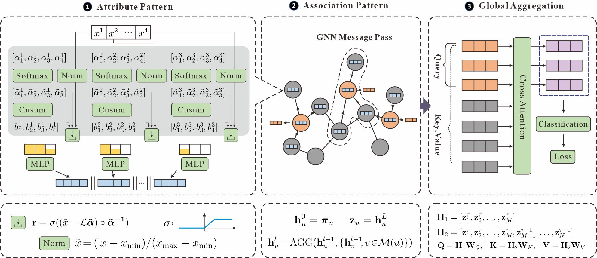

# Global Attribute-Association Pattern Aggregation for Graph Fraud Detection

This is the official implementation of the following paper:

> [Global Attribute-Association Pattern Aggregation for Graph Fraud Detection](https://ojs.aaai.org/index.php/AAAI/article/view/33264)
>
> Mingjiang Duan, Da He, Tongya Zheng, Lingxiang Jia, Mingli Song, Xinyu Wang, Zunlei Feng
>
> AAAI 2025 Main Track

##  Abstract

Fraud is increasingly prevalent, and its patterns are frequently changing, posing challenges for fraud detection methods such as random forests and Graph Neural Networks (GNNs), which rely on bin-based and mixture features separately. The former may lose crucial graph-associated features, while the latter face incorrect feature fusion. To overcome these limitations, we propose an approach based on attribute-association pattern that leverages the distinct attribute and association patterns differentiating fraudulent from benign behaviors, to enhance fraud detection capabilities. 
Attribute features are adaptively split into separate bins to eliminate incorrect attribute fusion and combine association patterns through graph neighbor message passing, thereby deriving attribute-association pattern features. Using the learned attribute-association patterns, the fraud patterns between a single pattern and the patterns across the entire graph are globally aggregated. Extensive experiments comparing our approach with 24 methods on 7 datasets demonstrate that the proposed method achieves SOTA performance.

## Framework

---


## Dataset Preparation
Datasets, which can be downloaded from this [google drive link](https://drive.google.com/file/d/1txzXrzwBBAOEATXmfKzMUUKaXh6PJeR1/view?usp=sharing). After downloading, unzip all the files into a folder named `datasets` within the GAAP directory. 

## Training Model:
- run <code> python mycode/exp/101_retrain.py -cn yelp</code>  for YelpChi dataset   
- run <code> python mycode/exp/101_retrain.py -cn tfinance</code>  for T-Finance dataset
- run <code> python mycode/exp/101_retrain.py -cn elliptic</code>  for Elliptic dataset
- run <code> python mycode/exp/101_retrain.py -cn tolokers</code>  for Tolokers dataset
- run <code> python mycode/exp/102_retrain_reallinear_att.py -cn tsocial</code>  for Tolokers dataset
- run <code> python mycode/exp/102_retrain_reallinear_att.py -cn dgraphfin</code>  for DGraph-Fin dataset

##  Mainly Dependencies:
- torch==2.2.0   
- dgl==2.3.0  
- toad==0.1.5  
- pandas==2.2.2  
- numpy==1.26.4  
- scikit-learn==1.5.0  
- lightning==2.3.0  
- wandb==0.16.5  
- hydra-core==1.3.2  
- rtdl_num_embeddings==0.0.12

## Citation

If you use this package and find it useful, please cite our paper using the following BibTeX. Thanks!

```
@inproceedings{duan2025global,
  title={Global Attribute-Association Pattern Aggregation for Graph Fraud Detection},
  author={Duan, Mingjiang and He, Da and Zheng, Tongya and Jia, Lingxiang and Song, Mingli and Wang, Xinyu and Feng, Zunlei},
  booktitle={Proceedings of the AAAI Conference on Artificial Intelligence},
  year={2025}
}
```
